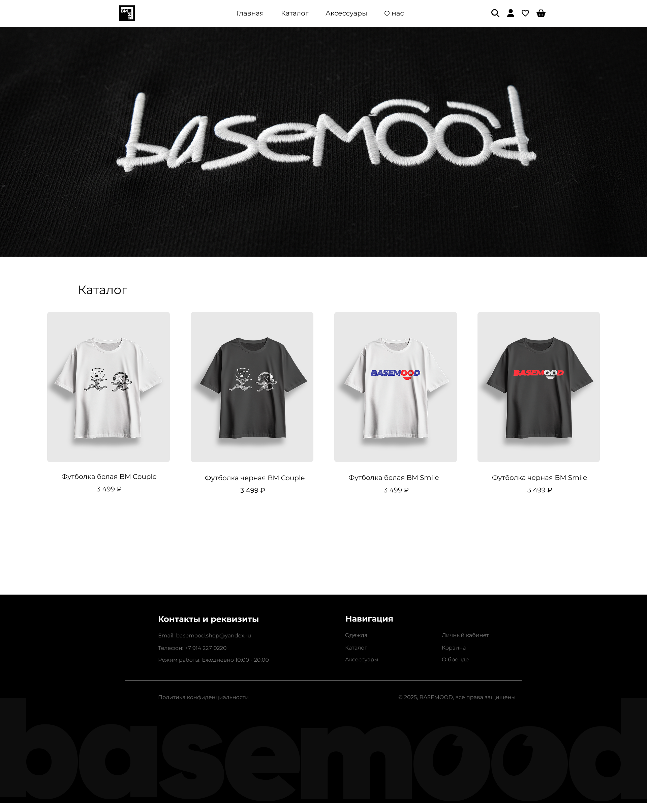
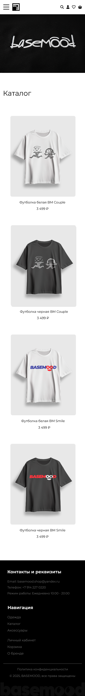
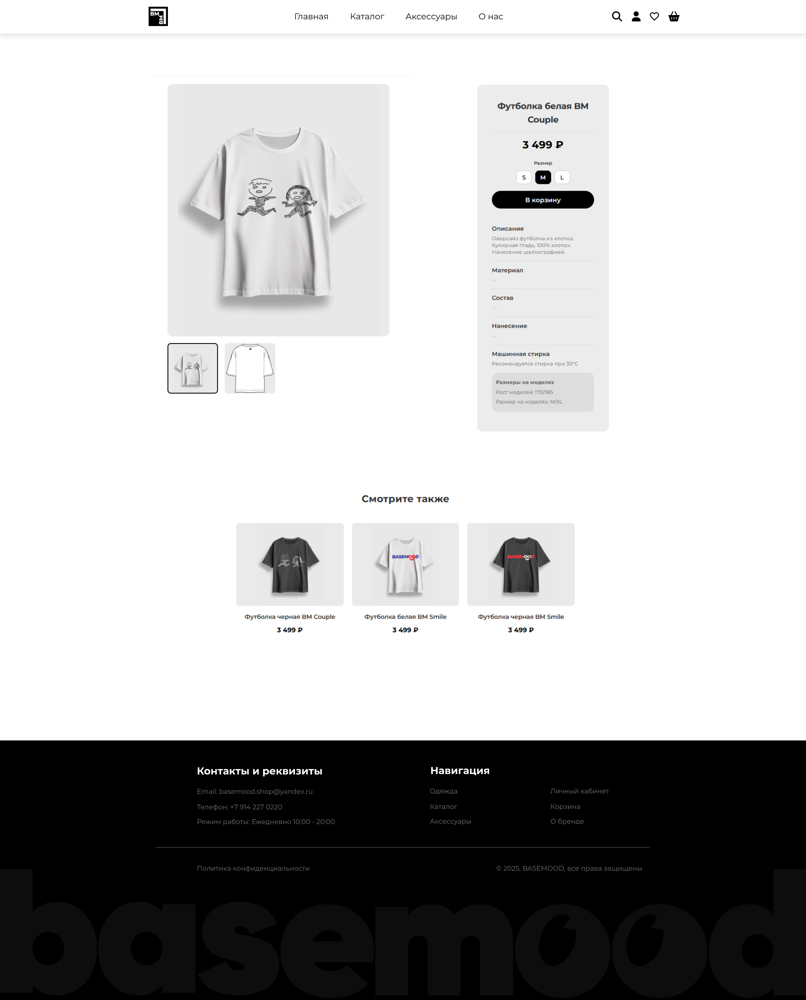
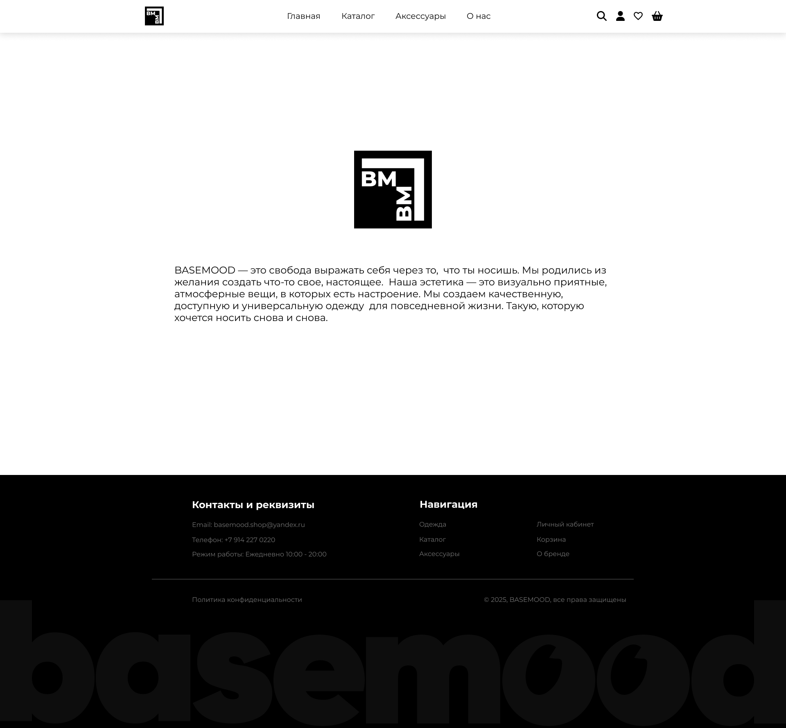
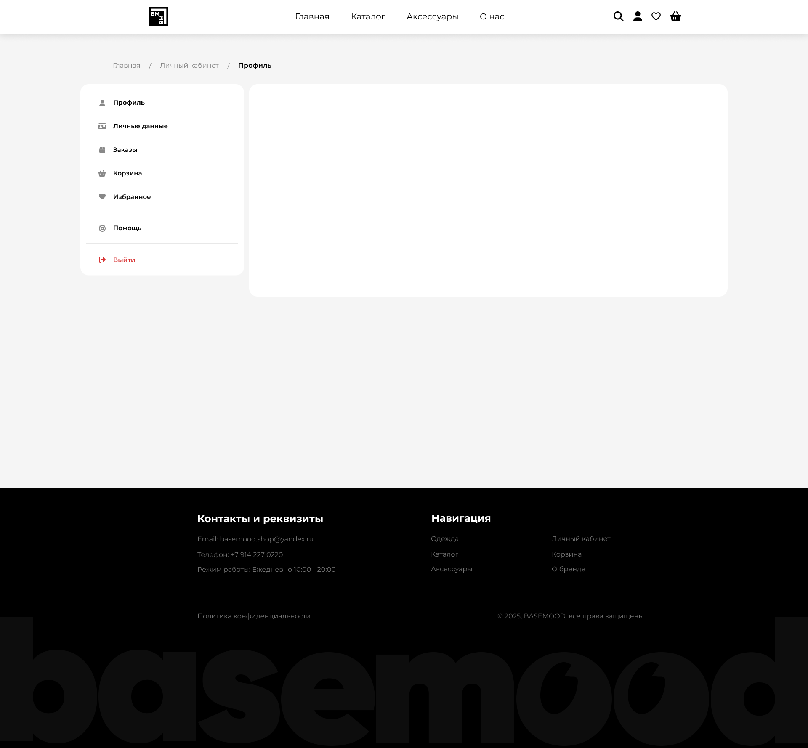
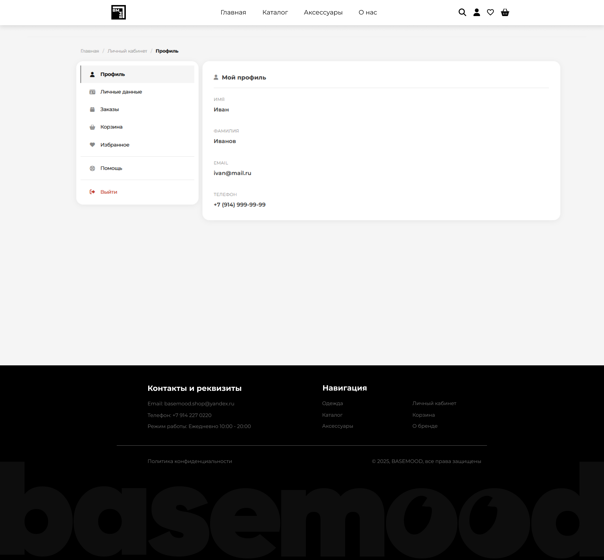
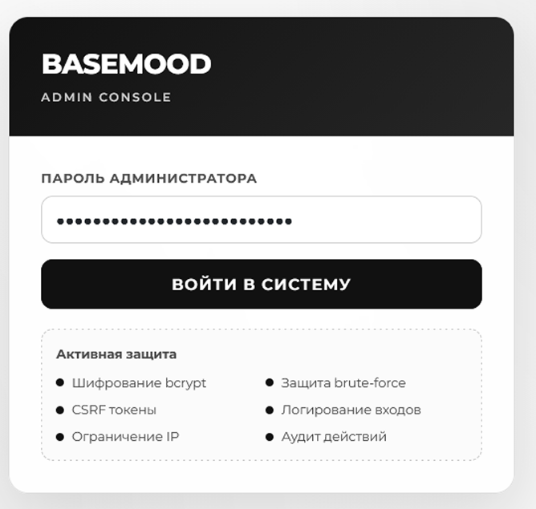
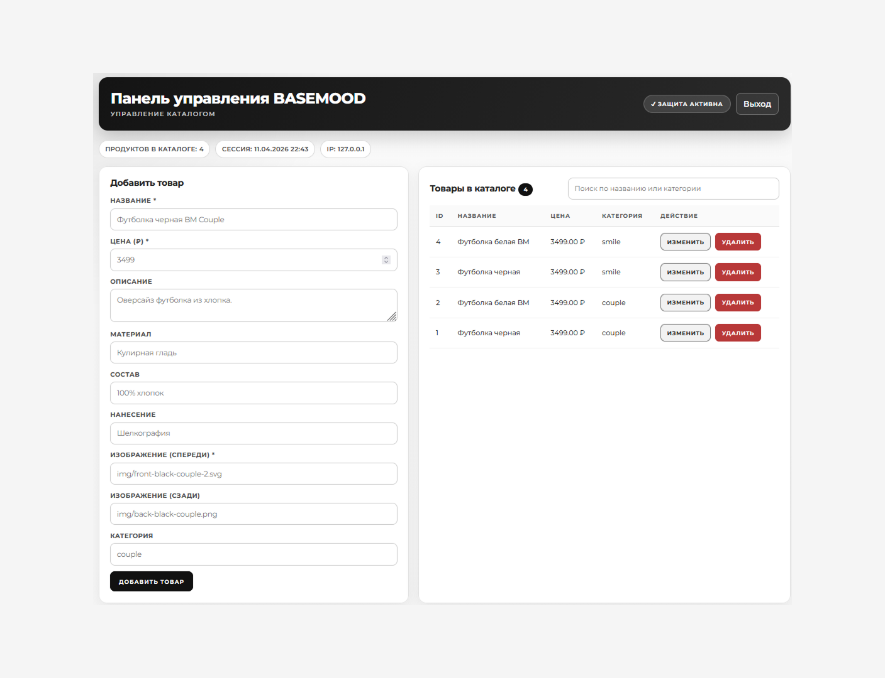

# Portfolio

UI/UX-макеты и веб-проекты.

## Basemood — интернет-магазин одежды

Разработка интерфейса интернет-магазина бренда одежды BASEMOOD: от UI-макета в Figma до вёрстки рабочих страниц, включая клиентскую часть и панель администратора для управления каталогом.

**Инструменты:** Figma, HTML, CSS

**Макет в Figma:** [Открыть в Figma](https://www.figma.com/design/9nOYVoTFOT1DmbJjIb8q5n/Untitled?m=auto&t=kSW6vOEedefe57T1-1)

### Главная страница

### Каталог (мобильная версия)

### Страница товара

### Страница «О нас»

### Личный кабинет

### Админ-панель
Панель управления каталогом с защищённой авторизацией (шифрование, ограничение по IP, логирование действий).

